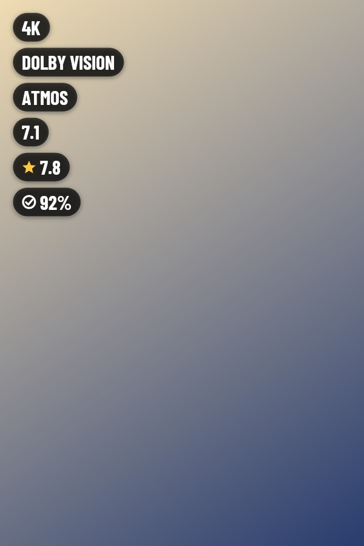
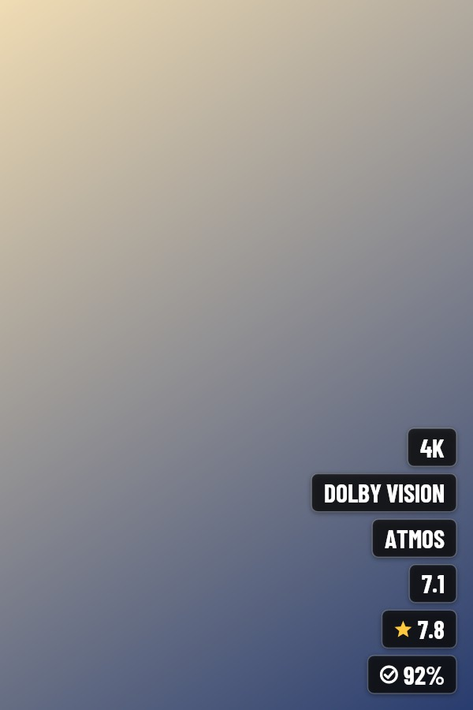

# JellyBadge

A Jellyfin server plugin that stamps quality and rating badges onto movie and series posters.

The badges are drawn into the poster image itself on the server, so they show up in every Jellyfin client: the web app, mobile apps and native TV apps such as Wholphin on Android TV. No CSS, no JavaScript, no client changes.

| Top left, pill | Bottom right, square | Bottom strip, minimal |
|---|---|---|
|  |  |  |

## Badges

| Group | Values | Source |
|---|---|---|
| Resolution | 4K, 1080p, 720p, SD | video stream size |
| Dynamic range | Dolby Vision, HDR10+, HDR10, HLG | video range type |
| Audio format | Atmos, DTS:X, TrueHD, DTS-HD MA | audio codec and profile |
| Audio channels | 7.1, 5.1 | audio channel count |
| Community rating | star and score, for example 7.8 | item metadata |
| Critic rating | check mark and percentage, for example 92% | item metadata |

Movies with several versions use the best version. Series use the most common quality across their episodes.

## Requirements

Jellyfin server 12.1 or newer.

## Install

### From the plugin repository (recommended)

1. In Jellyfin go to **Dashboard > Plugins > Repositories**, click **+** and add:
   ```
   https://github.com/PeterSlijkhuis/JellyBadge/releases/latest/download/manifest.json
   ```
2. Go to **Catalog**, install **JellyBadge** and restart the server. Updates show up in the same place.

### Manual install

1. Download `jellybadge_x.y.z.0.zip` from the [latest release](https://github.com/PeterSlijkhuis/JellyBadge/releases/latest).
2. Unzip it into a `JellyBadge` folder inside your server's `plugins` directory (for Docker usually `/config/plugins/JellyBadge`).
3. Restart the server.

### First run

Open **Dashboard > Plugins > JellyBadge**, pick your badges and layout, check a few posters with **Show preview**, then tick **Enable badges** and click **Save and apply to library now**.

From then on new and updated items are badged automatically, and a scheduled task checks the whole library once a day.

## How it works

- Before a poster is changed for the first time, the original is copied to the plugin data folder (`plugins/JellyBadge/originals`).
- The badged poster is saved as the item's Primary image in Jellyfin's own metadata folder. Files in your media folders are never written or deleted.
- A hash of the original, the badge settings and the detected badges is stored per item. Items where nothing changed are skipped.
- When a metadata refresh or a manual upload replaces a poster, JellyBadge treats the new image as the new original and badges it again.
- Work runs in the background with a concurrency limit, so library scans are never slowed down.

## Remove all badges

Open **Dashboard > Plugins > JellyBadge** and click **Remove all badges and restore originals**. This:

1. turns JellyBadge off, so nothing gets badged again,
2. puts every original poster back,
3. deletes all backups and state from the plugin data folder.

If a poster was replaced after it was badged (for example you uploaded a new one), the newer poster is kept.

**Run this before uninstalling the plugin.** Uninstalling alone leaves the badged posters in place.

## Build

```
dotnet test JellyBadge.slnx
dotnet publish Jellyfin.Plugin.JellyBadge -c Release -o out
```

Copy `out/Jellyfin.Plugin.JellyBadge.dll` into a `JellyBadge` folder in your server's `plugins` directory and restart.

## Release

Every push to `main` (for example merging a pull request) publishes a release automatically, with the note "Bug fixes and improvements." The release holds the plugin zip and an updated `manifest.json`, which is what the repository URL above points to. Changes that only touch Markdown or `docs/` do not release.

Version numbers come from `version` in `.github/plugin.json`:

- If no release has that version yet, it is released as is.
- After that, each release counts the last number up: 1.0.0, 1.0.1, 1.0.2 and so on.
- To jump, for example to 1.1.0 or 2.0.0, change `version` by hand. Counting continues from there.

You can also start a release by hand under **Actions > Release > Run workflow**.

## License

GPL-3.0. The bundled Barlow Condensed font is under the SIL Open Font License, see `Jellyfin.Plugin.JellyBadge/Rendering/Fonts/OFL.txt`.
