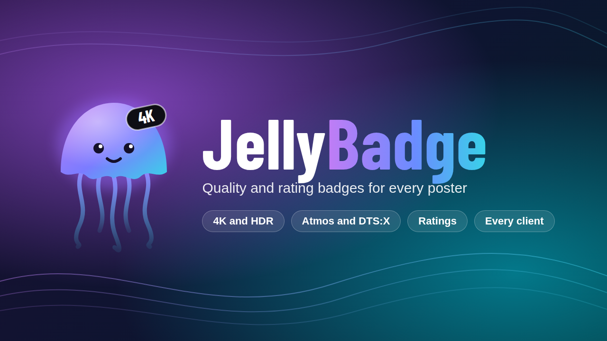
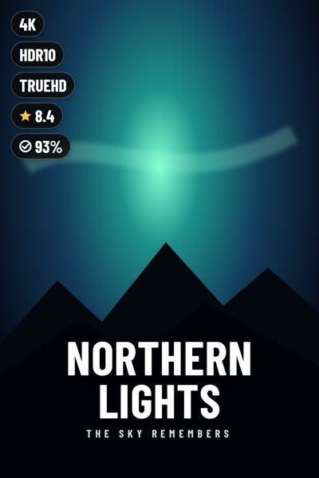
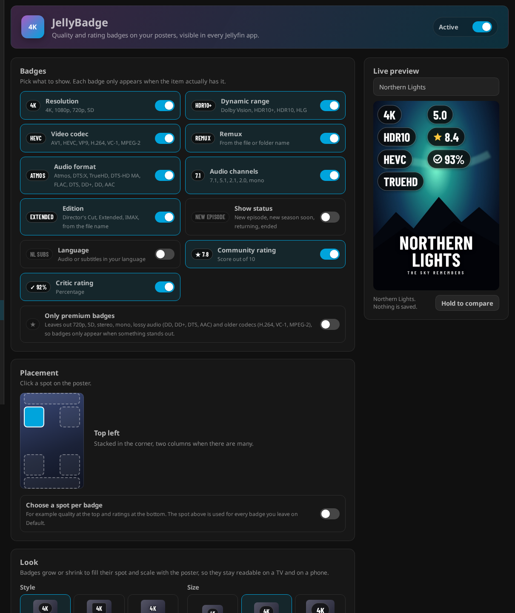

<p align="center">
  
</p>

<p align="center">
  <a href="https://github.com/PeterSlijkhuis/JellyBadge/releases/latest"></a>
  
  <a href="https://github.com/PeterSlijkhuis/JellyBadge/actions/workflows/build.yaml"></a>
  <a href="LICENSE"></a>
</p>

<p align="center"><b>Quality and rating badges on your posters, stamped on the server, visible in every Jellyfin app.</b></p>

JellyBadge adds clean badges like **4K**, **Dolby Vision**, **Atmos**, **★ 8.4**, **NEW EPISODE** and **DIRECTOR'S CUT** to your movie and series posters. The badges are drawn into the poster image itself, so they show up everywhere: the web app, phones, tablets and native TV apps such as Wholphin on Android TV. No themes, no CSS, no JavaScript, nothing to install on your devices.

**Know Kometa overlays from Plex?** JellyBadge brings the same idea to Jellyfin as a regular plugin: resolution, HDR, codec, audio and rating overlays on your posters, set up from the dashboard with a live preview. No scripts, no config files, no cron jobs.

<table>
  <tr>
    <th>Before</th>
    <th>After</th>
  </tr>
  <tr>
    <td></td>
    <td></td>
  </tr>
</table>

## Contents

- [What you get](#what-you-get)
- [Install](#install)
- [Getting started](#getting-started)
- [What it can and cannot do](#what-it-can-and-cannot-do)
- [Removing badges](#removing-badges)
- [FAQ](#faq)
- [For developers](#for-developers)
- [Credits](#credits)
- [License](#license)

## What you get

- **Works in every client.** Badges are part of the poster, so every Jellyfin app shows them, including ones that never load custom styles.
- **Smart detection.** Resolution, HDR format, codec, audio format and channel layout come from your actual files. For movies with several versions, the best one wins. For series, seasons and collections, the most common quality across the episodes or movies is used.
- **Ratings at a glance.** Community score and critic score from your existing metadata.
- **More than quality.** Optional badges for the edition (Director's Cut, Extended, IMAX), the show status (NEW EPISODE, SEASON 3 SOON, RETURNING, ENDED) and audio or subtitles in your own language.
- **Only what stands out.** One switch leaves out everyday quality like 720p, stereo and H.264, so badges only appear on the special stuff.
- **Your layout.** Pick one spot for all badges, or a spot per badge: quality top left, status top right, ratings along the bottom.
- **Your originals are safe.** Every original poster is backed up before the first change, and one button puts them all back.
- **Hands off.** New and updated items are badged automatically in the background. After library scans and metadata plugin tasks, and once a day, every poster is checked again. Library scans never wait on it.
- **Keeps up with changes.** When a metadata refresh, an upload or another tool replaces a poster, JellyBadge treats the new one as the original and badges it again.
- **Seasons, episodes and collections too, if you like.** Each has its own switch.
- **Live preview.** See exactly how a poster will look before anything is written.
- **Activity log.** The settings page shows what JellyBadge did and why, how many posters have badges, and a filter for just the problems.
- **Leave a poster alone.** Made a poster by hand? Click **Leave this poster alone** under the live preview and save, and it keeps its original.

### Badges

| Group | Badges | Comes from |
|---|---|---|
| Resolution | `4K` `1080p` `720p` `SD` | the video stream size |
| Dynamic range | `DOLBY VISION` `HDR10+` `HDR10` `HLG` | the video range type |
| Video codec | `AV1` `HEVC` `VP9` `H.264` `VC-1` `MPEG-2` | the video codec, off until you switch it on |
| Remux | `REMUX` | the file or folder name, off until you switch it on |
| Audio format | `ATMOS` `DTS:X` `TRUEHD` `DTS-HD MA` `FLAC` `PCM` `DTS` `DD+` `DD` `AAC` | the audio codec and profile |
| Audio channels | `7.1` `5.1` `2.1` `2.0` `MONO` and others | the audio channel layout |
| Edition | `DIRECTOR'S CUT` `EXTENDED` `IMAX` and others | Radarr's `{edition-...}` tag, or words after the year in the file or folder name (so "Uncut Gems" is not UNCUT), movies only, off until you switch it on |
| Show status | `NEW EPISODE` `SEASON 3 SOON` `RETURNING` `ENDED` | an episode that aired in the last 3, 7 or 14 days (your choice, 7 by default), a season starting in the next 7 days (needs unaired episodes, for example from the TMDb plugin), else the series status, off until you switch it on |
| Language | `NL` or `NL SUBS` | audio or subtitles in the language you pick, off until you switch it on |
| Community rating | `★ 8.4` | the item's community rating |
| Critic rating | `✓ 93%` | the item's critic rating |

Each group can be switched on or off. A badge only appears when the item actually has it. Switch on **Only premium badges** to leave out everyday quality (`720p`, `SD`, stereo, mono, lossy audio like `DD+` and `AAC`, and older codecs like `H.264`), so badges only appear when something stands out.

### Styles and placement

Pick a corner or a strip along the top or bottom, one of three styles and three sizes. Switch on **Choose a spot per badge** to give each badge group its own spot, for example quality top left, status top right and ratings along the bottom. Badges stay the same size in every spot and never overlap. Badges fill their spot: with only a few they grow (up to 2 times the chosen size), and with many they move to two rows or two columns so they stay readable on a phone. They also scale with the poster, so they stay readable on a big TV and on a small phone.

<table>
  <tr>
    <td align="center"><br /><sub>Top left, pill</sub></td>
    <td align="center"><br /><sub>Top right, square</sub></td>
    <td align="center"><br /><sub>Top strip, pill</sub></td>
    <td align="center"><br /><sub>Bottom strip, minimal</sub></td>
    <td align="center"><br /><sub>Bottom right, large</sub></td>
  </tr>
</table>

## Install

JellyBadge needs **Jellyfin 12.1 or newer**.

### Option 1: plugin repository (recommended)

1. Open **Dashboard > Plugins** and click **Manage Repositories**.
2. Click **+**, give it a name such as `JellyBadge` and paste this URL:
   ```
   https://github.com/PeterSlijkhuis/JellyBadge/releases/latest/download/manifest.json
   ```
3. Go back to **Plugins**, open **Available**, find **JellyBadge** and click **Install**.
4. Restart Jellyfin.

Updates show up in the same place and can install automatically.

### Option 2: manual install

1. Download `jellybadge_x.y.z.0.zip` from the [latest release](https://github.com/PeterSlijkhuis/JellyBadge/releases/latest).
2. Unzip it into a folder called `JellyBadge` inside your Jellyfin `plugins` folder. With Docker this is usually `/config/plugins/JellyBadge`.
3. Restart Jellyfin.

## Getting started

Open **Dashboard > Plugins > JellyBadge**.

<p align="center"></p>

1. **Pick your badges.** Click a tile to switch a badge group on or off. With **Language** on, pick your language in the list below the tiles. Switch on **Only premium badges** for a cleaner look.
2. **Choose the placement.** Click a spot on the little poster. To give badges their own spots, switch on **Choose a spot per badge** and pick a spot in each row.
3. **Choose a style and size.** The live preview updates as you go. Search any movie or series to try it on, and hold **Hold to compare** to see the original.
4. **Choose what to badge.** Under **Libraries**, pick libraries and switch on season posters, episode thumbnails or collection posters if you want them.
5. **Switch it on.** Flip the switch at the top to **Active**, then click **Save**. Posters update in the background, and every later save redraws only what changed.

JellyBadge is off after installing, so nothing changes until you switch it on. Progress of the first run shows under **Dashboard > Scheduled Tasks > Apply poster badges**.

The **Activity** section on the same page lists what JellyBadge did recently and why: posters it badged, posters that were replaced, restores and errors. **Only problems** hides everything but warnings and errors, and **Clear** empties the list.

## What it can and cannot do

**It can**

- Badge movie and series posters in the libraries you choose.
- Badge season posters with the most common quality of their episodes, when you switch that on under **Libraries**. The rating is the series rating, or the average of the episode ratings if you choose that. Home screen rows often show the season poster for a new episode.
- Use the best version of a movie that has several files.
- Show the most common quality of a series or season, based on its episodes.
- Badge episode thumbnails with the episode's own quality and rating, when you switch that on under **Libraries**. Switch it off again and the next run puts the original thumbnails back.
- Badge collection posters with the most common quality of the movies in them, when you switch that on under **Libraries**.
- Show the edition of a movie, the status of a series and a badge for audio or subtitles in your language.
- Place each badge group in its own corner or strip.
- Keep running by itself: new items, updated items, a check after library scans and metadata plugin tasks, and a daily check of everything.
- Put every original poster back with one click.

**It cannot**

- Badge backdrops or logos. Only the main poster of movies, series, seasons and collections, and the episode thumbnail, is changed.
- Tell a remux from an encode by the file itself. The Remux badge only shows when the file or its folder has "Remux" in the name.
- Add custom badges, colors, logos of rating sites, or seasonal and decorative overlays.
- Show SEASON SOON without upcoming episodes in Jellyfin. See the FAQ below.
- Detect what Jellyfin does not know. Badges are based on the media info Jellyfin reads from your files, so if Jellyfin does not report Atmos or DTS:X for a file, there is no badge for it.
- Say which site a rating came from. Jellyfin stores one community rating and one critic rating without a source, so the badges show a neutral star and check mark.
- Run on Jellyfin 10.x.

## Removing badges

Switch JellyBadge **Off** at the top of its settings page and save, or click **Restore originals**. Both:

1. switches JellyBadge off, so nothing gets badged again,
2. puts every original poster back,
3. deletes all backups and stored data of the plugin.

If you replaced a poster after it was badged, your newer poster is kept.

Uninstalling JellyBadge, or disabling it in Jellyfin's plugin list, does the same before it goes, so no badged poster is left behind. When you enable it in the list again, switch it on again on its settings page.

## FAQ

<details>
<summary><b>How is this different from Kometa or Plex Meta Manager overlays?</b></summary>

Kometa is a separate script you run on a schedule, built around Plex. JellyBadge is a Jellyfin plugin: you install it from the plugin catalog, set it up on its settings page with a live preview, and it badges new items by itself as they arrive. One button puts all original posters back.
</details>

<details>
<summary><b>My badges disappeared after the nightly tasks. What happened?</b></summary>

Some scheduled tasks and outside tools (metadata plugins, Sonarr, Radarr) can put the original poster back. JellyBadge checks all posters again after every other scheduled task finishes and badges them again, which takes seconds when nothing changed. A library scan or metadata refresh often swaps a badged poster back to the poster next to your media: JellyBadge puts the badged one back within a second, ahead of everything else it is doing. On top of that it looks 30 seconds after the server starts, and every 5 minutes after that, for badged posters that were swapped behind its back and badges them again, and while a scan has a file's media info half read, it keeps the badges it has instead of dropping them. The **Activity** section shows what changed and what was badged afterwards.
</details>

<details>
<summary><b>Why does SEASON SOON never show?</b></summary>

Jellyfin only knows about episodes that have not aired yet when a metadata plugin adds them. In **Dashboard > Plugins > TMDb**, tick **Create unaired (upcoming) episodes**, then tick each TV library in the list below it: the option is off by default and works per library. The TheTVDB plugin has a similar option. After the next **Refresh upcoming and missing episodes** task, series with a season starting within 7 days get the badge.
</details>

<details>
<summary><b>Does JellyBadge change files in my media folders?</b></summary>

No. Badged posters are saved in Jellyfin's own metadata folder. Your `poster.jpg` files and other artwork next to your media are never written or deleted, so tools like Kodi, Plex, Sonarr and Radarr never see a badged poster.
</details>

<details>
<summary><b>I switched it on, but my app still shows posters without badges.</b></summary>

Most apps keep posters in a cache. Give it a moment, pull to refresh, or clear the app's cache. Also check that the **Apply poster badges** task has finished under **Dashboard > Scheduled Tasks**.
</details>

<details>
<summary><b>A badge is missing or wrong for one item.</b></summary>

JellyBadge reads the media info Jellyfin collected for the file. Open the item, choose **Refresh metadata**, and the poster is updated with what Jellyfin finds. If Jellyfin itself does not show the format under the item's media info, JellyBadge cannot show it either.
</details>

<details>
<summary><b>I changed a poster myself. Will JellyBadge overwrite it?</b></summary>

It treats your new poster as the original, backs it up and adds badges to it. If you do not want badges on it, pick it in the live preview and click **Leave this poster alone**, then **Save**. It gets its original back and keeps it until you click **Badge again**. Leaving a series or season alone covers its seasons and episodes too.
</details>

<details>
<summary><b>Will it slow down my server or library scans?</b></summary>

No. Library events only add the item to a queue. The work happens in the background, two posters at a time by default, and items whose poster, settings and media did not change are skipped without even opening the image. New movies, shows and episodes are badged as soon as Jellyfin has their artwork, without waiting for the daily task. Jellyfin's housekeeping tasks, like plugin updates and log cleanup, do not trigger a check.
</details>

<details>
<summary><b>Where are the original posters kept?</b></summary>

In the plugin's data folder inside your Jellyfin data folder: `plugins/Jellyfin.Plugin.JellyBadge/originals`.
</details>

<details>
<summary><b>Do episodes have ratings?</b></summary>

Most do. Metadata providers such as TMDb and TheTVDB give each episode its own community score, so episode thumbnails get a star badge just like posters. Critic scores for single episodes are rare, so that badge usually stays away on episodes. Episodes that Jellyfin has no rating for simply get no rating badge.
</details>

<details>
<summary><b>What rating does a season show?</b></summary>

Seasons have no rating of their own in Jellyfin, so a season shows the series rating. Switch on **Season rating from its episodes** under **Season posters** to show the average of its rated episodes instead. Episodes without a rating are left out of that average.
</details>

<details>
<summary><b>Do I need to install anything on my TV or phone?</b></summary>

No. Everything happens on the server. Your apps just load the poster like they always do.
</details>

## For developers

```bash
dotnet test JellyBadge.slnx
dotnet publish Jellyfin.Plugin.JellyBadge -c Release -o out
```

- Built on the official [jellyfin-plugin-template](https://github.com/jellyfin/jellyfin-plugin-template), targeting .NET 10 and Jellyfin 12.1.
- Badge detection is plain logic in `Detection/BadgeDetector.cs`, covered by unit tests with stream fixtures in `Jellyfin.Plugin.JellyBadge.Tests/Fixtures`.
- **Releasing.** Open **Actions > Release > Run workflow**, fill in the version and release notes, and run it. It builds, tests and publishes a release with the plugin zip and `manifest.json`. Leave the version empty to count the last number up from the latest release (1.0.0, 1.0.1, 1.0.2). The notes default to "Bug fixes and improvements." and show up in Jellyfin's plugin catalog.

## Credits

- [Jellyfin](https://jellyfin.org) and its [plugin template](https://github.com/jellyfin/jellyfin-plugin-template).
- [SkiaSharp](https://github.com/mono/SkiaSharp) for drawing, using the copy that ships with Jellyfin.
- [Barlow Condensed](https://github.com/jpt/barlow) by Jeremy Tribby, used for the badge lettering under the SIL Open Font License.
- The posters in this README are made up for illustration.

## License

JellyBadge is licensed under the [GNU General Public License v3.0](LICENSE). The bundled Barlow Condensed font is licensed under the [SIL Open Font License 1.1](Jellyfin.Plugin.JellyBadge/Rendering/Fonts/OFL.txt).
